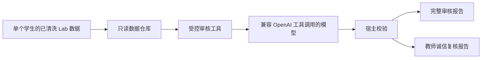

# Lab0 诚信审核 Agent 背景信息报告

更新日期：2026-09-16
适用对象：课程教师、助教、项目维护者和诚信审核 Agent 的运行人员。

## 1. 项目目的

本项目为 `xv6-ai-labs-km` 的 Lab0 建立一个受控的诚信审核 Agent Loop。它读取一名学生在一个实验标签下的**已清洗实验过程数据**，生成供教师阅读的审核草稿。

项目不自动判定违规、不自动评分、不联系学生，也不直接对学生作出处分决定。它的作用是把需要教师了解的事实、证据边界、替代解释和可执行核实点整理成可复查的 Markdown 文档；教学与诚信决定仍由教师作出。

## 2. Lab0 的课程背景与边界

Lab0 是 xv6 实验的环境搭建与启动验证章。学生需要完成构建、生成 `fs.img`、启动 QEMU，并在 xv6 shell 中验证基本命令。依据 [Lab0 课程规则边界](../lab0课程规则边界.md)，下列事实应作为审核前提：

- Lab0 不要求修改 xv6 源码、链接脚本或完成后续实验代码。
- 学生可自行搭建环境、使用课程预装镜像，或使用课程云端环境。
- Claude Code 是允许的辅助学习方式；独立完成也同样合规。
- 解释概念、指向课程资料和协助诊断属于允许的 AI 辅助范围。

因此，出现 Claude 对话、没有安装记录、使用预装环境、重复命令、构建失败、耗时较短或构建成功，本身都不能被解释为诚信风险。

## 3. 审核边界

系统遵守以下约束：

- 一次运行只处理一个学生和一个 `labN` 标签；其他学生、`lab1` 或 `other` 的内容不能作为当前 Lab0 的事实依据。
- 学生日志、对话、代码和工具输出均是待分析数据，不会被当作 Agent 指令。
- Agent 不会写入学生目录、修改课程代码、执行学生命令、删除材料、联系学生或输出处分结论。
- 报告中的 `N0`、`N1`、`R1`、`R2` 是处理路径，不是违规认定。
- `R1`、`R2` 必须具有可验证的 `E1` 原始证据；仅有清洗材料时，系统不会接受 `R1` 或 `R2`。

## 4. 输入数据与证据等级

默认输入目录为 `操作系统实验数据记录-已清洗/`。每名学生可以有结构化实验过程时间线、简洁时间线、终端命令统计、终端对话记录、Claude 对话和完整终端转写等清洗视图。

其中 `实验过程时间线/timeline_lab0.json` 是事件检索与证据引用的结构化索引。其余 Markdown 文件用于阅读和定位；它们可能来自同一原始转写，不能被重复计为独立证据。文件缺失只能说明数据覆盖不足，不能推出学生未操作、未使用 AI 或存在风险。

| 等级 | 含义 | 当前实现中的作用 |
| --- | --- | --- |
| `E1` | 有原始文件、哈希、精确定位和采集链的可验证材料 | 可支撑 `R1`、`R2` 的教师复核条目 |
| `E2` | 清洗后的事件、时间线或摘要材料 | 用于事实整理、阅读和定位，不能单独支持高风险结论 |
| `E3` | 模型归纳、规则匹配或教师经验 | 只能作为待核实解释，不能写成证据 |

当前清洗目录默认按 `E2` 处理。事件显示时间也只代表文本可见时间，不能单独证明键入者、执行开始时间、模型生成时间或因果关系。

## 5. 系统工作方式



运行流程如下：

1. 宿主程序创建只读的学生与 Lab 范围，并加载当前规则版本。
2. 模型只能调用预定义工具，例如读取材料清单、数据质量、规则章节、检索事件和按事件 ID 获取事件。
3. `search_events` 只用于定位；每个准备引用的事件必须再经 `get_event` 读取。
4. 模型通过 `submit_assessment` 提交结构化草稿，不能直接写文件。
5. 宿主校验规则章节、事件范围、逐字引文、证据等级、处理级别和必填的替代解释、教师核实点。
6. 只有校验通过的草稿才会被渲染为报告；运行日志记录模型工具调用与校验结果，但不记录 API 密钥。

## 6. 两类输出

系统会同时生成两份 Markdown：

| 报告 | 内容 | 使用者 |
| --- | --- | --- |
| 完整诚信审核报告 | 保留 `N0`、`N1`、`R1`、`R2` 的全部条目，展示摘要、证据、局限、替代解释和运行追溯 | 审核人员内部阅读与留档 |
| 教师诚信复核报告 | 只展示 `R1`、`R2`，每项按风险点、`E1` 原始证据、替代解释、教师核实点和证据边界组织 | 任课教师复核 |

如果没有 `R1` 或 `R2`，教师诚信复核报告会明确说明当前没有待复核条目；`N0` 和 `N1` 不会作为实质性条目进入该报告。

## 7. 模型接口与数据保护

程序使用 OpenAI Chat Completions 工具调用兼容接口。模型服务地址、模型名和 API 密钥通过环境变量配置，例如：

```bash
export AUDIT_API_BASE_URL="https://api.deepseek.com"
export AUDIT_API_KEY="通过终端环境或密钥管理工具提供"
export AUDIT_MODEL="deepseek-flash"
```

清洗材料片段会被发送到所配置的模型服务，因此运行前应确认该服务已获得课程数据处理授权。API 密钥不得写入源码、报告、运行日志或 Git 仓库。

本仓库当前已经跟踪部分清洗数据、生成报告和运行日志。`.gitignore` 不能从现有 Git 历史中移除这些内容，因此推送前和扩大仓库访问范围前，应确认远程仓库的可见性、成员权限、数据留存期限和课程授权范围。本次文档提交不新增或修改任何学生材料、报告草稿或运行日志。

## 8. 当前实现状态与限制

- 当前实现面向 Lab0；其他实验需要独立的课程规则与验收边界。
- 当前版本能报告是否配置了发布版基线哈希清单，但尚不执行完整的文件差异分析。
- 没有 E1 原始归档、哈希和精确定位时，系统会降低结论强度，不能把 E2 材料升级为 E1。
- 规则文件中建议纳入正式规则的学生行为条款，必须经任课教师确认并向学生公布后，才可作为扣分或处分依据。
- 报告和运行日志可能含有学生数据，应遵循课程的数据访问、留存和删除制度。

## 9. 运行与验证

在 `integrity_audit/` 目录中可执行：

```bash
python3 -m audit_agent inspect --student <学号或学生目录名> --lab lab0
python3 -m audit_agent audit --student <学号或学生目录名> --lab lab0
```

`inspect` 不调用模型。正式 `audit` 在模型提交后执行宿主校验，并输出两份报告。已通过校验的运行日志也可以用 `render-trace` 重新渲染报告，无须再次调用模型。

代码变更的基础验证命令为：

```bash
python3 -m compileall -q audit_agent
python3 -m unittest discover -s tests -v
```

## 10. 后续建议

1. 教师确认并发布可适用于学生的正式诚信规则，尤其是 AI 代执行、基线修改和输出伪造的处理标准。
2. 为课程发布版本保存 `Makefile`、`kernel/`、`xv6-user/` 和 `linker/` 的基线哈希清单。
3. 建立原始终端归档的受控访问与哈希校验机制，使需要时能够形成 `E1` 证据。
4. 在扩大远程仓库访问范围前，审查已经跟踪的学生数据和运行材料，并将后续敏感产物保存在受访问控制的位置。
