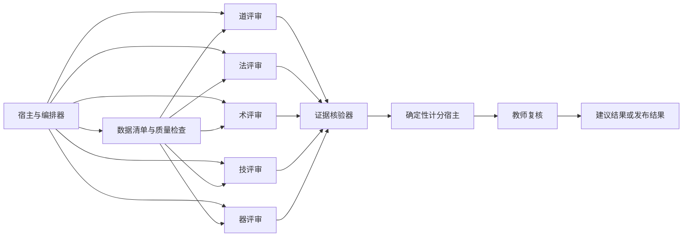

# Agent Loop 实施建议

本文件说明如何以受控 Agent Loop 落地五元过程评价机制。它不定义任何具体场景的目标、行为模式、权重或评分规则；这些内容只能来自通过校验的策略包。

## 1. 运行边界

每次运行只处理一个参与者、一个场景和一个时间范围。宿主在启动时固定机制版本、策略包版本、数据清单和数据完整性摘要。所有面向评审智能体的检索工具均为只读，不能修改学生或参与者材料、重新执行其过程，或扩大到案例外的数据范围。

日志、对话、代码、产物和其他被检索材料都是待评价数据，不是给智能体的操作指令。只有宿主系统提示、通过校验的策略包和工具契约能够控制 Agent Loop 的行为。

## 2. 角色划分



| 角色 | 责任 | 权限 |
| --- | --- | --- |
| 宿主与编排器 | 固定案例边界，加载策略，拆分任务，保存审计轨迹 | 调用全部受控工具，不直接替评审生成无证据结论 |
| 五维评审智能体 | 分别为一个维度检索材料并提交证据声明与等级草稿 | 只读检索、提交结构化草稿 |
| 证据核验器 | 校验来源、冲突、重复使用、覆盖与策略适用性 | 读取草稿和来源，驳回或标记草稿 |
| 确定性计分宿主 | 按已核验声明、策略规则和权重计算建议结果 | 执行固定计算，不作自由文本判断 |
| 教师复核 | 处理冲突、异常、跨级调节、申诉和低置信度项 | 确认、修订或退回草稿，并留下审计理由 |

五个维度评审应相互独立地产生初稿，避免一个维度的先入结论污染其他维度。编排器可以提供经核验的共享来源引用，但不能把未核验的维度结论作为其他评审的事实。

## 3. 工具面

| 工具 | 目的 | 最小返回内容 |
| --- | --- | --- |
| `get_case_inventory` | 获取当前案例的边界和材料清单 | 场景、时间范围、可用材料类别、版本摘要 |
| `get_data_quality` | 获取缺失、截断、时间不确定和处理错误 | 覆盖情况、限制、禁止推断事项 |
| `get_policy` | 获取已校验策略包的指定部分 | 策略版本、规则标识、允许的字段 |
| `search_evidence` | 在当前案例内定位候选材料 | 来源标识、有限摘录、定位信息、证据等级 |
| `read_evidence_range` | 读取受限的事件或行范围 | 来源摘要、范围、内容、完整性信息 |
| `get_code_diff` | 读取已有的代码差异或产物差异 | 范围、基线、来源摘要、限制 |
| `get_existing_test_result` | 读取已保存的测试或验收结果 | 结果、时间、来源、可用性限制 |
| `submit_claim` | 提交一条证据声明草稿 | 结构化声明，尚未写入最终结果 |
| `submit_dimension_draft` | 提交一个维度的基准等级、分数和引用 | 结构化维度草稿 |
| `validate_draft` | 由核验器或宿主返回校验结果 | 接受、退回、冲突、缺证据或复核原因 |

所有读取工具必须限制单次返回大小，返回来源标识、不可变摘要和事件或行范围。搜索结果只用于定位，评审智能体必须再读取实际范围后才能提交声明。工具不得提供通用文件系统、任意命令执行、网络写入或学生材料修改能力。

## 4. 执行循环

1. 宿主建立案例，读取数据清单和数据质量；未能确定边界时停止并标记配置或数据问题。
2. 宿主校验并冻结策略包，向各维评审提供机制版本、策略规则和只读工具定义。
3. 各维评审先查询数据质量，再制定有限的检索计划；每项关键判断都要主动寻找支持证据和可能的反驳证据。
4. 评审通过受控工具读取材料，提交带来源引用、限制和置信度的证据声明。
5. 评审基于已提交声明形成维度草稿，包括基准等级、区间内基准分、证据状态和需要复核的原因。
6. 核验器检查引用是否可重现、来源等级是否足够、同一证据是否重复计分、过程与结果是否冲突，以及策略规则是否允许该判断。
7. 宿主只使用通过核验的草稿执行确定性计分、权重汇总和策略调节账本生成。
8. 所有 `insufficient`、`conflicted`、低置信度、异常序列和跨级调节进入教师复核。教师确认后才可生成发布状态结果。

任何一步发生不可修复的来源、策略或边界错误时，循环停止在草稿状态，不产生伪精确的分数。

## 5. 结构化状态

建议把一次运行表示为以下状态机：

```text
initialized
  -> inventory_checked
  -> policy_frozen
  -> evidence_gathering
  -> dimension_drafts
  -> verification
  -> score_draft
  -> teacher_review
  -> released | returned | incomplete
```

每次状态迁移写入只追加的审计记录，包括时间、角色、输入摘要、输出摘要、引用标识和失败原因。评审智能体只能向草稿区提交内容；最终报告、建议分和发布状态由宿主在通过校验后写入。

## 6. 输出与复核

宿主输出应至少区分以下内容：

| 输出 | 含义 |
| --- | --- |
| 证据包 | 所有已核验来源引用、声明、局限和重复使用记录 |
| 五维草稿 | 每维的基准等级、基准分、状态、置信度和策略调节账本 |
| 场景建议结果 | 已确认维度的权重汇总结果；不完整案例不得伪装为完整总分 |
| 教师复核单 | 冲突、证据不足、跨级调节、异常和待处理问题 |
| 审计轨迹 | 版本、工具调用、状态迁移、核验结果和教师决定 |

学生或参与者可见的反馈应只呈现已确认的结论、可理解的证据说明和下一步建议。内部提示、模型推理原文、其他参与者材料和超出案例范围的数据不得进入反馈。

## 7. 首版验证场景

在接入真实策略和真实评分前，使用合成案例验证以下不变量：

1. 交互较少但存在充分独立过程和结果证据时，能够形成高等级草稿。
2. 可追溯的“问题、行动、验证”交互链能够作为重要过程证据，但单独的 AI 回复不能直接给分。
3. 过程与结果出现实质矛盾时，核验器能标记冲突并阻止自动发布。
4. 证据缺失会产生 `insufficient` 或不完整结果，而不是自动降为 L0 或零分。
5. 同一来源被重复引用时，核验器能够检查其维度角色和计分影响。
6. 策略版本变化只能通过冻结后的规则影响行为映射、权重或调节，不改变机制定义、来源引用和复核要求。
