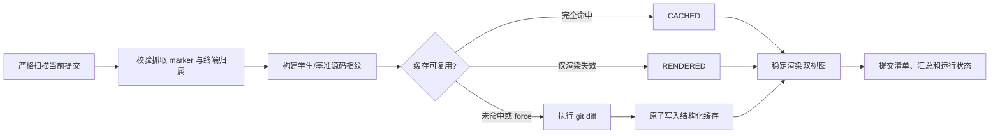

# 代码差异报告工具重构说明

本文记录源码差异报告工具从“每次全量扫描并逐文件执行 Git”到“按当前提交和源码指纹增量生成”的重构契约。目标是减少重复比较，同时保持教师现有的按人、按 Lab 和汇总浏览路径不变。

## 旧流程

旧实现按提交目录遍历每个 Lab 的文件，每次运行都重新计算学生与基准的文件集合，并对每个变化文件调用 `git diff --no-index`。`.lab_diff_reports.json` 只登记正式报告归属，不记录源码指纹、比较规则或可重建的结构化差异。因此，重复运行会再次读取和比较所有文件；提交目录改名、从非仓库根启动或只修改一个 Lab，也可能造成无关单元重复处理。

旧输出还使用单一的学生目录和简化的汇总路径，不能可靠地校验按人视图与按 Lab 视图是否一致。报告中的运行时间会随每次执行变化，难以确认输入不变时产物是否真的稳定。

## 新流程

抓取工具、终端清洗工具和差异工具按以下顺序交接：

1. 抓取工具从远端索引选择每名学生的最新归档，发布唯一目录和 `.xv6-sync-source.json`。
2. 终端清洗工具处理该目录，并刷新 `.replay_term_qa.json`，其 `source` 精确指向当前提交。
3. 差异工具严格扫描 marker、终端归属和源码树，计算指纹，复用可用缓存或执行必要的比较。
4. 差异工具从结构化结果稳定渲染个人报告、镜像报告、清单和汇总。



差异工具只接受具有有效 `.xv6-sync-source.json` 的当前提交目录。目录名、`student_id`、姓名、归档 SHA-256 和提交信息必须一致；重复学号、无 marker、损坏 marker、身份冲突、符号链接或 junction 进入结构化诊断，不猜测来源，不删除原始数据。相对 `source` 路径相对于声明的仓库根或 `--submissions-root` 解析，不能依赖进程启动目录。差异工具不修改终端清洗归属文件。

## 缓存契约

缓存根为 `操作系统实验数据记录-已清洗/.lab-diff-cache/`。一个缓存单位对应：

```text
学生学号 × 当前归档 SHA-256 × Lab × 比较规则
```

条目至少包含：

- `cache_owner`、缓存 schema 版本和分析器签名；
- 当前学生来源相对路径、归档身份和审计信息；
- 学生侧与基准侧的源码清单：相对路径、文件类型、大小和 SHA-256；
- 学生源码树指纹、基准 Lab 指纹、Git 版本、Git 参数和空白符策略；
- 结构化 `DiffEntry`、增删行数、文件统计、二进制诊断和可重建汇总所需状态；
- 正式报告的渲染签名、内容 SHA-256 和双视图镜像状态。

缓存不保存学生完整源码。只有成功结果和可确定的“Lab 不存在”结果可以写入；Git 失败、文件读取失败、路径不安全或输入在扫描/比较期间变化时不写入不可信结果。缓存文件必须带本工具所有者标记，清理时拒绝跟随链接或 junction。

分析器签名和渲染签名分离：源码范围、文件哈希、Git 参数、空白符策略、Git 版本或分析器代码变化会使结构化比较失效；Markdown 文案、报告布局或汇总模板变化只使渲染失效，可以从结构化差异重建正式报告。

## 失效与状态

| 输入变化或操作 | 影响范围 | 结果状态 |
| --- | --- | --- |
| 未变化的学生归档、基准 Lab 和比较规则 | 一个学生/Lab 单元 | `CACHED` |
| 报告缺失、镜像哈希不一致或模板变化 | 一个学生/Lab 单元 | `RENDERED`，不调用 Git |
| 学生一个 Lab 的源码或归档 SHA-256 变化 | 该学生该 Lab | `REBUILT` |
| 基准一个 Lab 变化 | 该 Lab 的全部学生 | `REBUILT` |
| 目录名变化但归档 SHA-256 相同，且上游归属已刷新 | 对应学生/Lab | `RECONCILED`，复用差异并更新来源 |
| `--force` | 本次选中的学生和 Lab | `REBUILT` |
| 当前提交缺少某个 Lab | 该学生该 Lab 的本工具报告 | 删除登记报告并记为 `SKIPPED`/诊断 |
| 原始提交整体消失或无法匹配 | 已有正式报告 | 保留报告，汇总记为 `PARTIAL_FAILED`/诊断 |
| Git、读取或输入稳定性失败 | 失败单元 | `FAILED` 或 `PARTIAL_FAILED`，不写成功缓存 |

运行日志显示本次实际动作（`CACHED`、`RENDERED`、`RECONCILED`、`REBUILT`、`SKIPPED`、`PARTIAL_FAILED` 或 `FAILED`）及其原因。汇总把已经成功发布、可复用的动作统一显示为稳定的 `CACHED`，而跳过和失败状态保留原诊断；这样重复运行不会因为缓存动作名称变化而改写正式汇总 Markdown。失败状态不能伪装为成功缓存，也不能覆盖可恢复的旧正式产物。

## 正式输出与原子发布

正式路径固定为：

```text
按人分类/<学生>/<labN>/代码差异报告工具/代码差异报告.md
按Lab分类/<labN>/<学生>/代码差异报告工具/代码差异报告.md
汇总报告/代码差异报告汇总/代码差异报告汇总-labN.md
```

每个个人报告都有 `.lab_diff_reports.json` 所有权清单。发布前校验目标目录、双视图镜像和清单没有人工文件、外部来源或链接；随后在同一卷临时文件中生成并校验两个报告和新清单，最后原子替换。发布中途失败时保留旧缓存和旧正式报告。已有报告及镜像哈希正确时，缓存命中不会重写文件。

正式 Markdown/JSON 不包含运行时间，而是使用稳定的来源指纹、基准指纹、比较规则、分析器签名和渲染签名。汇总按 `Lab → 学号 → 姓名` 稳定排序，所以输入不变时重复运行应保持正式文件字节和 SHA-256 不变；运行时间只允许出现在运行日志。

## 清理边界

只有不带 `--student` 的完整扫描在输入校验和清洗归属都成功后，才可清理当前选中 Lab 中旧 schema、旧分析器版本或当前源扫描不再引用的本工具缓存。`--student`、`--dry-run`、扫描不完整、不安全路径或身份验证失败时，不做全局清理；未选中的 Lab 也不受影响。`--dry-run` 只列出计划清理项。清理只处理普通缓存文件，不删除原始提交、人工文件、终端归属文件或正式报告。

## 验证结果与日常检查

代码实现完成后，在代码差异报告工具目录运行：

```bash
python3 -m unittest discover -s tests -v
python3 -m py_compile generate_lab_diff_reports.py
git diff --check
python3 generate_lab_diff_reports.py --all-labs --dry-run
```

回归至少应证明：首次冷运行生成两个视图和清单；第二次相同输入不再调用 `git diff` 且正式 Markdown/JSON 哈希不变；学生单 Lab 变化只重算一个单元；基准 Lab 变化只失效对应 Lab；渲染变化可从缓存恢复；缺失 Lab、提交消失、损坏缓存、链接和输入变化都遵守上述保留与失败语义。

真实数据验收按“抓取工具 → 终端清洗工具 → 代码差异报告工具”执行。完成一次全量运行后再次运行差异工具，确认未变化单元显示 `CACHED`，并检查两个视图的报告内容和哈希一致。
