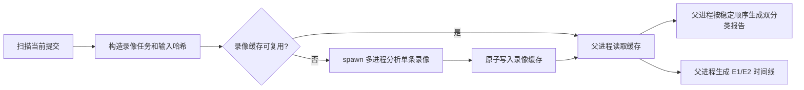

# 终端重放性能重构说明

本次重构将终端清洗从“按学生、按报告阶段重复重放”改为“按录像分析一次、由多个产物复用”。正式报告仍保持按人和按 Lab 的双分类布局、原有相对链接与汇总目录；变化集中在重放调度、缓存和时间线输入。

## 解决的问题

学生每次上传的是完整提交。旧流程即使只有一条录像变化，也会重新解压并重放该学生此前的全部录像，而且完整转写、Claude QA 和时间线会各自重复读取同一对 `.out.gz` / `.tim.gz`。

现在的增量断点位于**录像边界**：同一学生下一次完整提交中的未变化录像直接从输出根的 `.replay-cache/` 读取分析结果，只有变化的录像进入重放进程。报告和时间线仍会按当前提交目录重建，因此来源、学生目录和输出归属保持正确。多个保留提交若包含同一份录像内容，会合并为一个分析任务；其中任一任务要求精确复核时，该次共享分析会直接产出精确结果。

## 缓存契约

每个缓存条目都保存以下信息：

- 缓存身份：`学生身份 + 录像文件名`，再结合 `.out.gz`/`.tim.gz` 哈希和 timing 状态生成缓存键。
- 当前或原始提交中的相对来源路径，用于审计。
- `.out.gz` 和 `.tim.gz` 的 SHA-256 输入哈希。
- 分析器签名、Lab 区间、提示符和命令锚点、时间索引、终态转写、Claude QA 及其有限帧证据。
- 能力标记，区分“终态转写可用”和“逐帧精确结果可用”。

缓存命中要求稳定身份、输入哈希、分析器签名和所需能力全部匹配。分析器签名只覆盖录像分析规则、相关代码和 `pyte`/`wcwidth` 版本，不因报告文案变化而失效。提交目录中的采集时间变化不会使未变录像失效；修改任一录像正文、计时文件、分类规则或相关分析器代码会使对应录像失效。精确结果可以满足后续混合模式，混合结果在需要时会升级为精确结果。

只有不带 `--student` 的完整源扫描会清理旧分析器版本和已经不在当前源中的本工具缓存项。`--student` 是局部扫描，不会清理任何不在本次选择范围内的学生缓存。清理只处理带本工具所有者标记的缓存文件，不删除原始录像、用户文件或正式报告。`.replay-cache/` 本身以及其中的链接/junction 不会被跟随；不安全的 `.tim.gz` 也会降级为无计时诊断，而不是读取外部目标。

扫描时会同时记录文件哈希和轻量文件状态。若输入在哈希、缓存查找或分析期间变化，任务会给出结构化 `input_changed_*` 诊断，不写入也不复用不一致的录像缓存；对应学生的报告与时间线不会静默命中旧学生级产物。

## 重放策略

`hybrid` 是默认模式。每条录像都会完成一次终态转写和可审计索引；只有以下录像进行逐时间帧 Screen 扫描：

- 同时出现 Claude 用户和回复角色标记的录像。
- Shell 解析失败、计时文件缺失、损坏或未覆盖完整录像的录像。
- 通过重复的 `--exact-recording` 指定的录像。

`exact` 对选中范围内所有录像执行逐帧扫描，用于复核和回归比较。`--exact-recording` 接受输入根相对的 `<学生目录>/term/<录像ID>`，也接受当前选择范围内唯一的裸录像 ID；可重复指定。

完整终端转写不依赖 timing 帧。分析器将完整正文一次性传给 `ByteStream.feed(body)`，保留终态、滚屏和清屏语义，同时避免为每个 timing 块复制整屏快照。Shell 命令仍使用现有的短片段 pyte 渲染；复杂控制序列继续走精确片段路径。跨 Lab 录像只生成一次完整转写，在每个相关 Lab 报告中复用，并注记该 Lab 的原始字节区间。

## 全量提交与断点边界

| 情况 | 是否重放终端录像 |
| --- | --- |
| 同一学生在新提交目录中再次上传完全相同的录像对 | 否，复用录像缓存 |
| 只修改一条 `.out.gz` 或 `.tim.gz` | 只重放该条录像 |
| 只修改 `logs/events.jsonl` | 否，只重建 E2 日志佐证、相关时间线和学生汇总 |
| 使用 `--exact-recording` 或 `--replay-mode exact` | 仅指定录像或选中范围升级为逐帧重放 |
| 使用 `--force` | 忽略选中范围的缓存命中并重新分析 |
| 在同一 `.out.gz` / `.tim.gz` 内追加内容 | 是，整条录像重放 |

最后一行是刻意的边界。本轮不保存单个录像的帧级检查点，也不尝试从 gzip 中随机续读；这样避免引入原生依赖和难以审计的终端状态恢复。采集器如果将会话拆成独立录像，前面的录像可以完全跳过。

## 并行与确定性

父进程负责输入校验、学生输出目录分配、任务排序、缓存清理、缓存读取和全部 Markdown/JSON 写入。任务按 timing 文件体量或录像体量优先调度，减少尾部等待。

子进程使用 Windows `spawn` 上下文的 `ProcessPoolExecutor`。父进程先按缓存键合并重复任务，再把每个唯一录像缓存文件交给一个子进程；子进程只返回小型状态记录，完整分析对象始终由父进程从缓存读取，因此不会把大量终端帧通过进程管道复制。默认进程数为 `min(12, 可用 CPU 核数)`；`--workers` 可覆盖该值。

父进程按稳定的学生和录像顺序聚合缓存结果，因此不同 worker 数的正式 Markdown/JSON 内容保持一致。单条录像失败只写结构化诊断和部分失败报告，不会中止同批其他录像。

## 证据与时间线

- **E1 终端屏幕证据**来自录像中的 pyte 终端状态、命令锚点和 Claude 帧证据，保留字节范围与可用 timing 定位。
- **E2 采集日志佐证**来自 `logs/events.jsonl`，明确显示日志行号、关联置信度和其自身的时间语义，不会伪装成终端屏幕证据。

时间线直接消费录像缓存，不再重新解压或重放录像。计时文件无效时，缓存仍提供终态和字节证据，但时间字段保持缺失，不伪造相对或绝对时间。

## 验证范围

回归覆盖包括一次性转写的清屏、滚屏和宽字符语义，复杂命令回显，Claude QA 帧提取，缺失/损坏 timing，跨 Lab 录像，无 Claude 标记录像，Windows `spawn` 调度，缓存能力升级、缓存清理、目录变化后的同学生全量提交复用，以及 E2 日志证据。

还验证了同一小型输入在 `1` 和 `12` 个 worker 下生成的正式 Markdown/JSON SHA-256 一致；后续完整提交目录变化时，第二次运行命中录像缓存且不会创建新的进程池。附加回归验证了输入扫描后修改、分析期间修改、同一缓存键的 hybrid/exact 合并，以及 stage 快照在文件状态变化后重新哈希。

## 冷缓存基准

性能验收在目标环境中使用相同输入根和全新的输出根完成。旧串行基线提交为 `be80c909ac34c48e8737e748e3ed24141575a969`；Windows 无法可靠地从用户态清除内核文件缓存，因此“冷缓存”在这里指新的 `.replay-cache/` 输出根。

| 运行 | 墙钟时间 | 相对旧串行 | 备注 |
| --- | ---: | ---: | --- |
| 旧串行全量（2026-09-20 记录） | 3,269 秒（54 分 29 秒） | 100% | 31 个输入学生目录，29 名学生完成重放与时间线 |
| 当前 `hybrid --workers 12`（2026-09-21） | 591.602 秒（9 分 52 秒） | 18.10% | 31 个输入学生目录、625 条录像；29 名学生完成，2 个无可处理录像目录按预期失败 |

当前混合模式比旧串行全量快约 **5.53 倍**，低于 `653.8` 秒的 20% 门槛，达到本次性能目标。`--workers 1` 和 `--workers 4` 的真实数据集测量按当前验收范围未执行。

详细的日常使用、参数和依赖见 [README.md](README.md)。
