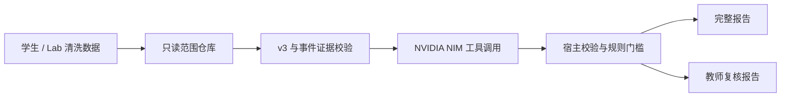

# 学生 / Lab 诚信审核系统背景说明

更新日期：2026-09-18
适用对象：任课教师、助教、项目维护者和运行人员。

## 1. 目标与边界

系统把一名学生在一个实验（`labN`）中的清洗数据、代码 diff 和 AI/人工贡献评估整理成可复核报告。它不自动认定违规、不评分、不联系学生，也不替教师作出处分决定。

每个任务都固定为一个学生目录和一个 Lab。模型不能跨学生、跨 Lab 读取材料，不能执行学生命令、访问任意文件或写入学生目录。学生日志、对话、代码和工具输出都被视为待分析数据，不能把其中的文字当作 Agent 指令。

## 2. 数据与证据

默认数据根目录是：

```text
/Users/neoa/OS-Lab-Score/操作系统实验数据清洗/操作系统实验数据记录-已清洗/
```

除时间线、终端摘要和对话清洗视图外，系统读取：

- `代码差异报告/labN.md`：当前 Lab 的代码 diff 摘要或范围材料；
- `AI人工贡献识别/assessment/assessment_labN.json`：`ai-human-contribution-assessment/v3` 评估；
- v3 assessment 指向的 source path、SHA-256、行号和 excerpt。

宿主程序会重新读取受控范围，比较 hash、路径、行号和 excerpt，并检查 diff hunk、schema version、学生/Lab 边界及独立复核状态。失效或存在分歧的单元会被隔离。v3 贡献证据接入 Agent Loop 后，模型只能引用已经通过这些检查的单元。

| 等级 | 含义 | 用途 |
| --- | --- | --- |
| `E1` | 有受控原始文件、哈希、精确范围和采集链 | 可支撑 `R1`/`R2` 的教师复核条目 |
| `E2` | 清洗事件、时间线、代码 diff 或 v3 贡献范围 | 事实整理和教师核实线索 |
| `E3` | 模型归纳或规则匹配 | 只能作为待核实解释 |

同一原始归档生成的多个清洗视图不能重复计为独立证据。缺少材料表示覆盖不足，不能据此推断学生未操作、使用 AI 或存在风险。

## 3. 宿主判定与标签



模型提交的草稿只是候选输入。宿主在校验通过后生成一个标签：

| 标签 | 宿主处理路径 |
| --- | --- |
| `完全诚信` | 未形成复核线索 |
| `基本诚信` | 教学提醒或资料边界 |
| `存在疑点` | 有效贡献材料形成教师核实线索 |
| `高风险待核实` | 独立 `E1` 与 `R1/R2` 门槛同时满足 |
| `资料不足/无法判定` | 材料、v3 评估或覆盖不足 |

`R1` 和 `R2` 仍是复核路径，不是违规结论。贡献层默认是 `E2`，不能单独进入高风险路径。`lab0` 的规则注册和贡献分流由宿主规则注册表控制；没有正式规则注册的 Lab 不会因为贡献标签自动升级风险。

## 4. NVIDIA NIM

系统使用 NVIDIA NIM OpenAI 兼容接口，默认模型为 `nvidia/nemotron-3-super-120b-a12b`。运行时只从环境读取密钥和非敏感参数：

```bash
export NVIDIA_API_KEY='由密钥管理器注入的 nvapi 密钥'
export NVIDIA_API_BASE_URL='https://integrate.api.nvidia.com/v1'
export NVIDIA_MODEL='nvidia/nemotron-3-super-120b-a12b'
export NVIDIA_MAX_TOKENS='32768'
export NVIDIA_CONNECT_TIMEOUT_SECONDS='15'
export NVIDIA_READ_TIMEOUT_SECONDS='300'
export NVIDIA_TEMPERATURE='1.0'
export NVIDIA_TOP_P='0.95'
```

请求包含 `chat_template_kwargs.enable_thinking=true` 和 `force_nonempty_content=true`。reasoning 内容仅在当前 Agent Loop 的内存上下文中用于下一轮，不写入报告、assessment 或 JSONL trace。客户端会处理 SSE 分片工具调用，并对网络失败、HTTP 429 和临时 5xx 错误进行有限退避重试。真实 API key 不应出现在文档、源码、报告、日志或 Git 历史中。

参数核对来源：[NVIDIA Nemotron 3 Super 官方模型说明](https://build.nvidia.com/nvidia/nemotron-3-super-120b-a12b.md)。该说明建议所有任务（包括 tool calling）使用 `temperature=1.0`、`top_p=0.95`，并给出 `enable_thinking` 与 reasoning budget 的配置方式。

## 5. 输出与批处理

输出按学生目录和 Lab 固定组织，重复运行会原子替换当前报告：

```text
诚信审核报告草稿/<学生目录>/<labN>/完整诚信审核报告.md
教师复核报告草稿/<学生目录>/<labN>/教师诚信复核报告.md
诚信审核运行日志/<学生目录>/<labN>/assessment.json
诚信审核运行日志/<学生目录>/<labN>/audit_manifest.json
诚信审核运行日志/<学生目录>/<labN>/runs/<时间戳>.jsonl
诚信审核运行日志/batches/<批次名>/summary.json
```

完整报告保留全部 N0/N1/R1/R2 条目，并在首屏展示标签、覆盖、贡献单元和来源定位。教师报告只突出需要教师行动的条目和证据边界。来源展示被限制为 path、hash、行号和短 excerpt，不展开完整学生材料。

批处理命令示例：

```bash
python3 -m audit_agent batch --lab lab0
python3 -m audit_agent batch --student <学号> --lab lab0 --lab lab1
python3 -m audit_agent batch --all-labs --resume
```

每个学生/Lab 独立记录 `complete`、`missing`、`deferred` 或 `failed`。`--resume` 复用输入指纹未变化的成功任务；`--retry-failed` 重试失败任务；`--force` 忽略缓存。批次即使有失败项也会写出汇总，便于后续补跑。

## 6. 数据保护与运行建议

1. 运行前确认课程已授权把清洗材料发送到所选 NVIDIA NIM 服务。
2. 用环境变量或密钥管理器注入 `NVIDIA_API_KEY`，不要把密钥写进 shell 历史、仓库或共享配置。
3. 报告、trace 和批次汇总可能包含学生数据，应限制访问并按课程制度留存和删除。
4. 对需要正式处理的事项，应先取得教师确认的规则版本和可验证的 `E1` 原始归档；模型输出只能帮助定位和整理。

## 7. 验证

在 `integrity_audit/` 目录执行：

```bash
python3 -m compileall -q audit_agent
python3 -m unittest discover -s tests -v
```

测试使用离线假客户端，不会调用真实 NIM 服务。通过校验的 JSONL 可以用 `render-trace` 重新生成当前模板的两份报告，宿主会再次重算标签，不信任日志中模型自行填写的结论。
